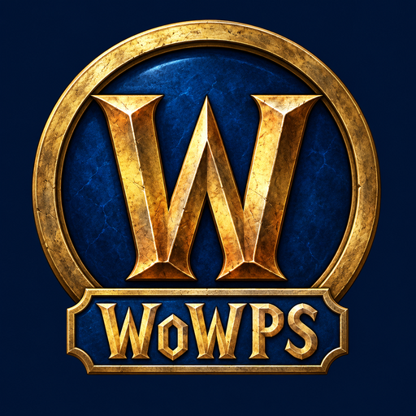

<p align="center">
  
</p>

<h1 align="center">WoWPS</h1>
<p align="center"><em>World of Warcraft, running natively on a jailbroken PlayStation 4.</em></p>

<p align="center">
  
  
  
  
  
</p>

\---

> \[!IMPORTANT]
> \*\*WoWPS is a development and research project. Original client MPQ archives are not included.\*\*
> You must supply your own legally obtained game data and comply with the laws in your jurisdiction.
> WoWPS is not affiliated with or endorsed by Blizzard Entertainment.

\---

## What this is

WoWPS is a **native** World of Warcraft client for the PS4 — not a streaming
client, and not an emulator running the PC build. It is C++ compiled for the
console's own hardware, with a Vulkan 1.0 ICD written on top of the PS4's native
GNM/VideoOut driver.

It reads **your** WotLK 3.3.5a (build 12340) MPQ archives: terrain, buildings,
creatures, character models, textures, sounds, and the original Blizzard
FrameXML interface. Loading the original interface does **not** mean that every
underlying game system or every screen is already complete.

There are two ways to play, and they are different things:

**Connected play.** The client includes protocol support for compatible
AzerothCore, TrinityCore and MaNGOS servers. In this mode, the external server
provides the world rules and server-side content. The console port's complete
end-to-end compatibility with each server is not established by the local-realm
tests.

**Standalone play.** WoWPS includes its own local world simulation for
singleplayer and host/join LAN play. It combines your client data with a bundled,
attributed local-realm catalog. This is a **bounded ruleset written for this
project**, not a complete embedded AzerothCore or TrinityCore server. Importing
world records does not execute the original server's quest or encounter scripts.

\---

## What works, and what does not

**Public release: 1.90 / PS4 package version 01.90 — 10 September 2026.**

The public release advances directly from **1.61 to 1.90**. This README describes
the combined capabilities and remaining limitations of 1.90.


|Status|Meaning|
|:-:|-|
|✅|Fully implemented and confirmed working within the specific scope described. This does not mean complete original-game parity.|
|⚠️|Partly working, but functionality, presentation or reliability is still incomplete.|
|❌|Not implemented or not functional in the stated mode.|

The tables distinguish the local simulation from connected play. A window, a
loaded map or a successful build does not by itself prove the corresponding game
system works. **Untested compatibility is not automatically marked ❌.** Where
there is only implementation or host-test evidence, that limitation is stated.
New or partial implementations move from ❌ to ⚠️; ⚠️ becomes ✅ only after
the stated scope is fully implemented and confirmed working. A successful build
or a new code path alone is not sufficient to turn a feature green.

### Engine and platform

|Status|Feature|Scope / remaining limits|
|:-:|-|-|
|✅|Native PS4 application and installable `.pkg`|Built with the OpenOrbis toolchain for installation on a jailbroken PS4.|
|✅|Vulkan 1.0 ICD over GNM/VideoOut|Native console rendering and presentation.|
|✅|Terrain, WMO buildings, M2 objects and animated characters|Core world rendering is available. This is not a guarantee that every asset or location is free of errors.|
|✅|Zone and time-of-day lighting|Uses `Light.dbc` and its colour bands.|
|✅|Terrain, building, object and character shadows|Shadow rendering includes same-model M2 caster instancing and an individual-draw fallback. Grouping order is cached until membership changes; transforms and visibility are checked each frame.|
|✅|1080p / 720p render-resolution selection|Changing render resolution is separate from correct automatic UI scaling.|
|⚠️|Original FrameXML loading from MPQs|Original UI scripts load from client data. NPC controller navigation starts on available quest actions or conversation options, checking visibility and enabled state. Complete interface coverage and console behaviour remain unverified. Native fallback is disabled.|
|⚠️|Water reflections, lens flare and portal effects|Rendering paths exist. Complete visual parity for every effect is not verified; reflections are off by default on PS4. The former separate sun-ray pass/switch is retired.|
|⚠️|World streaming and memory management|Compact WMO grids, progressive source release, retained snapshots and allocation-failure recovery reduce memory pressure. Memory exhaustion and extended travel stability remain unresolved risks on the console.|
|⚠️|Performance|Pipelined submission, shadow batching/instancing, cached caster order and retained presentation buffers are present. Frame rate varies; sustained performance is not guaranteed.|
|⚠️|Overall stability|The game reaches gameplay, but extended travel, character/portrait changes and shutdown are not reliably crash-free.|
|❌|Expansions after WotLK in this PS4 release|Not supported as a completed console gameplay target.|

**Other configurations:** PS5 compatibility has not been established. Upstream
Vanilla 1.12 and TBC 2.4.3 support must not be read as a verified PS4 feature; the
release target documented here is WotLK 3.3.5a, build 12340.

### Original interface, menus and controller

|Status|Feature|Scope / remaining limits|
|:-:|-|-|
|✅|Original menu, loading-screen and in-game assets|Read from the supplied client archives rather than replaced with unrelated artwork.|
|✅|Controller input, cursor mode and on-screen keyboard|Movement, camera, action layers and text input are implemented.|
|⚠️|Complete controller navigation of the original UI|Navigation includes adjacent panels, clipped hit targets, panel scrolling and modal/keyboard guards. Not every original panel has been confirmed working on PS4.|
|⚠️|Original 1:1 GUI|FrameXML runs with controller targeting, but layout, layering and class-specific behaviour remain incomplete.|
|⚠️|24-slot backpack|Physical cells are saved, with moves, splits, merges and whole-stack swaps. Free-cell counting handles gaps. Console confirmation and additional bags remain open.|
|⚠️|Automatic UI layout at different resolutions|Forward anchors resolve in one pass and root dimensions update before resize events. The old automatic 4% inset migrates to zero once. Final console placement remains to be checked.|
|⚠️|Quest watch / Objectives|Tracking and progress hooks are implemented and host-tested against the original scripts; console layout is not certified pixel-perfect.|
|⚠️|Character and target portraits|Authored cameras, field of view and bounds are checked, with lower-memory loading and cleanup after failed model loads. Portrait preparation can still fail under memory pressure; console presentation remains unverified.|
|⚠️|Death Knight resource UI|Runic Power events and six base-rune timers exist. Connected-server rune snapshots are checked before updating slots or callbacks. Complete appearance and interaction still need console confirmation.|
|⚠️|Minimap placement, including the reported Death Knight defect|Viewport/scissor follow the active framebuffer. Invalid rectangles and nonfinite display inputs are rejected before GPU recording. Console visual confirmation remains pending.|
|⚠️|Race intros, camera and audio presentation|Intro paths, loading and narration are present; complete race-by-race fidelity and smooth playback remain unverified.|

### Connected play — AzerothCore / TrinityCore / MaNGOS

The existing client documents the following network-side capabilities. They are
**not** a claim that all of them were tested end to end on a PS4 running this release,
and they do **not** make the same features available in standalone mode.

|Client capability|Console verification|
|-|-|
|Login, realm list, character list, creation and deletion|Client paths exist; complete compatibility with each server implementation remains unverified.|
|Movement, combat, casting, looting, quests and chat|Client paths exist; server-side content and console correctness must be checked separately.|
|Inventory, equipment, vendors, trainers, mail and auction house|Client paths exist. Local auction delivery is not the connected server's mail system.|
|Groups, other players, transports and taxi flights|Client paths exist; full console multiplayer coverage is not established.|
|Battlegrounds and arenas|Not verified on the console. This is distinct from the missing standalone systems listed below.|

### Standalone play — world, quests, combat and characters

|Status|Feature|Scope / remaining limits|
|:-:|-|-|
|✅|Local world without an external server|Explore, fight NPCs, loot, gain experience and level within the local ruleset.|
|✅|Local character data and saves|Characters and progress are stored with the realm. The realm writes save format 19 and reads formats 1–18; timed self buffs, talents, larger spellbooks, riding ranks, taxi discovery and active flights join the atomic realm snapshot.|
|✅|Basic quest lifecycle|Accept, track, complete, turn in and abandon supported catalog quests. Rewards above the money cap are refused; turn-in saves before acknowledgement and rolls back on failure.|
|⚠️|All original quests|The catalog contains 919 adapted quests, including 139 with item choices and 18 with multiple fixed rewards. Supported objective rules do not reproduce every quest chain, condition or scripted sequence.|
|✅|Basic NPC combat and supported spells|Melee attacks plus the implemented direct-damage, healing and periodic-damage spell subset.|
|⚠️|Healing-over-time spells|Supported single-target periodic healing uses imported amounts, durations, intervals and rank relationships, with cast/target checks. Owner icons, timers and recipient cancellation are present. Full aura interactions and spell coverage remain incomplete.|
|✅|Cast times, interruption and cooldowns|Supported spells use authority-owned resource checks, reserve cooldown capacity before committing effects and recheck pending casts on completion.|
|✅|Death and revival|Present in the local gameplay ruleset.|
|⚠️|Complete classes and combat|Supported mechanics include selected-player healing, friendly periodic healing, timed fixed health/armor buffs and fixed shields against NPC melee. Channeling, forms/stances, pets, procs, many aura types, totem/reagent requirements and area/scripted targeting remain incomplete. Unsupported abilities are rejected.|
|⚠️|Death Knight gameplay|Runic Power, imported rune costs, six independent base-rune cooldowns and persistence are implemented. Full weapon/disease effects, talents and Death-rune conversion are unfinished.|
|✅|Inventory, equipment and item stats|Local 24-slot inventory and all 19 worn slots. Equipment checks available level/class/race metadata and saves changes before confirmation, with rollback. Full proficiencies, item instances, bags and durability remain incomplete.|
|✅|Local progress persistence|Equipment, supported quest/spell/profession progress, learned mounts and rune cooldowns are included in the saved state. Each console retains its local action-bar setup.|
|⚠️|Complete original character progression|Limited spell/recipe books and missing talent, reputation and advanced class systems prevent complete retail progression.|
|⚠️|Talent trees and talent-point spending|The original talent UI uses saved, host-checked ranks, level points, tiers and prerequisites, with free local test resets at class trainers. Supported direct/periodic abilities and unconditional flat health/physical-armor talents can be learned. Unsupported effects do not spend points. Full trees, pets, forms, procs, other auras, glyphs and dual specialization remain incomplete.|
|❌|Reputation progression and reputation-gated services|No working standalone reputation system; unsupported gated vendor offers are excluded.|
|❌|Pets and stables|No working standalone pet acquisition, pet progression or stable service.|

### Standalone play — travel, instances and scripted content

|Status|Feature|Scope / remaining limits|
|:-:|-|-|
|✅|Flight masters and taxi-route data|Saved discovery, atomic direct-flight purchases and in-flight save/resume are implemented, with return to departure if route geometry changes. Gossip offers destinations. Graphical taxi-map integration and connecting hops remain open.|
|⚠️|Ships and zeppelins|Configured hulls, authored routes, boarding, continent transfers and static crews exist. Boarding/disembarkation saves before acknowledgement; transient state resets at seams or lost routes. Coverage and repeated-travel stability remain incomplete.|
|⚠️|Innkeepers and return-home travel|Bind to the selected innkeeper and return on a cooldown. Both actions save before acknowledgement, with position/cooldown rollback on failure. Binding during taxi/transport travel is blocked; world-floor rescue clears transient travel state. Hardware confirmation remains pending.|
|⚠️|Dungeon and raid access|Supported entrances, instance maps and catalog population exist. Parties receive isolated bindings; entry/exit saves atomically. Travel guards and relocation checks reject stale world data. Revival refreshes the entrance region. Encounter scripts, difficulty, lockouts and resets remain incomplete.|
|✅|Acherus floor-transfer pads|The paired lower/upper-floor transport logic is implemented; effect appearance depends on available models.|
|⚠️|Scripted world events|Specific Acherus transfers exist, but the local catalog does not execute imported server scripts. General original quest/world events and phasing remain incomplete.|
|❌|Complete dungeon and raid boss encounter scripts|Loading boss models or NPC records does not implement encounter phases, mechanics or scripted progression.|
|❌|Full server script execution in standalone mode|The local catalog does not execute the AzerothCore/TrinityCore encounter and quest-script libraries.|
|⚠️|Ground mounts|Supported mount items can be learned, saved, summoned, replicated and dismounted. Learning saves atomically; summon completion checks level and riding rank. Two ground-riding ranks are supported. Flying, discounts and class-specific training remain open.|
|❌|Flying mounts, vehicles and unsupported scripted mount effects|Not functional in the local ruleset; unsupported mount purchases are blocked.|
|⚠️|Complete riding profession and trainer progression|Apprentice/journeyman ground riding is available at 15 named catalog trainers, with local prices, saved ranks, prerequisites and original trainer/skill UI. Flying ranks, reputation discounts and class-specific quests remain open.|

### Standalone play — professions, merchants and auction house

|Status|Feature|Scope / remaining limits|
|:-:|-|-|
|⚠️|Professions|Learning, rank training, 96 learned recipes, unlearning and batches of 1–20 crafts are supported, including saved fractional skill gains. Tools remain in inventory; duplicate reagents are combined and race/class restrictions checked. Unsupported extra effects are blocked. Gathering, specialist requirements and non-item effects remain incomplete.|
|⚠️|Class and profession trainers|Original Trainer/TradeSkill addons expose supported local training and crafting. Training checks the selected trainer and prerequisites, replaces lower ranks and carries cooldowns forward. Combat/casting/travel blocks training. Specialist services and full ability coverage remain incomplete.|
|✅|Basic merchant buying and selling|Per-NPC catalog stock, copper prices, purchase bundles, quantity checks and bag-capacity checks.|
|⚠️|Original MerchantFrame|Retail panel initialization and callbacks are host-tested; complete console UI/controller behaviour remains to be validated.|
|⚠️|Limited merchant stock|The host enforces shared stock and saves depletion and partial restock intervals. Timers advance only during active simulation. Console confirmation remains pending.|
|⚠️|LAN merchant state|Guests receive selected-vendor stock and private buyback pages. The host checks faction, identity, map, instance, range and life state. Further two-console testing remains necessary.|
|⚠️|Merchant buyback|A saved 12-entry ledger connects to the original MerchantFrame and LAN commands, with save-before-acknowledgement rollback. Sales exceeding the wallet cap are refused before changing items or history. Console interaction and full retail equivalence remain unconfirmed.|
|❌|Equipment durability, wear and real repairs|Durability is not tracked. The repair interaction is a no-op and does not charge gold; it must not be described as working repairs.|
|❌|Extended-currency, reputation-gated and script-conditioned vendor offers|Excluded until their conditions can be enforced.|
|⚠️|Playerbots|Optional wandering/fighting/gathering actors pause incompatible actions while dead, casting, flying or in instances. Dungeon spawning and combat-time listings are blocked. Simulated sellers share a 224-listing cap. Bots are not complete player-equivalent characters.|
|✅|Auction supply without walking playerbots|Virtual auction traders run independently, including when the Playerbots option is off.|
|⚠️|Local auction house|Browse, list, bid, buy out, expire and cancel unbid listings, with multi-stack posting, refunds and saved deliveries. Queue capacity is checked exactly and listing IDs survive empty-board restarts. The exchange is bounded and not a complete retail economy.|
|⚠️|Original Blizzard\_AuctionUI|Loaded before opening; production callbacks are host-tested. Full PS4 visual/controller and two-console transaction validation remains outstanding.|
|✅|Saved auction escrow and pending delivery|Full bags and offline owners retain pending items/proceeds. Escrow transfers to owner mail when space is available. Money collection preserves the unpaid remainder at the wallet cap.|
|⚠️|Automatic random 4–10× base multiplier with no menu control|Each new simulated listing draws a multiplier before rarity/drop/mount premiums and seller variation. Existing listings and player prices are retained. Console market confirmation remains pending.|
|⚠️|Full retail auction deposits, sale cuts and mailbox settlement|Purchased goods, expired/cancelled items, proceeds and bid refunds use local mail. Deposits, sale cuts and retail invoices remain absent; cancellation after bids is unavailable.|

The auction board is capped at **256 listings**, with at most **224 listings shared by virtual sellers
and walking bots**, reserving 32 places for humans. Existing saves over the new
simulated limit retain their listings and stop adding supply until below the cap. Zero-vendor-value materials use an explicit local pricing rule. TCG
mount pricing uses the local **100,000-gold** cap; this is not presented as an
original retail price. Catalog details are in the
[vendor catalog](tools/local_realm/VENDOR_CATALOG.md).

### Standalone play — LAN, social systems and PvP

|Status|Feature|Scope / remaining limits|
|:-:|-|-|
|⚠️|Host / Join LAN|A custom host-authoritative UDP realm replicates player, travel and gameplay state. Expired sessions are removed before commands/simulation; console counts exclude bots. Matching builds and further two-console testing are required.|
|✅|Versioned LAN messages and local save codecs|LAN protocol 34 and save format 19 (reading formats 1–18). Private mail and owner progress assemble atomically. Saved state includes talents, spellbooks, riding, taxi discovery/flights and timed self buffs. Transient healing views are private to their owner.|
|⚠️|Player-to-player trade|Private two-player sessions support six item stacks per side and copper, revision-checked mutual acceptance and atomic saving. Requires nearby same-faction online humans on the same map/instance and known unbound, unequipped items. Full binding/enchantment rules and console confirmation remain open.|
|⚠️|Mailboxes and player mail|Original mail UI supports saved letters, up to 12 attachments, gold, COD, returns and saved offline recipients. Actions save atomically. Mail is available at innkeepers and local mailbox model sites near catalog inns, Northshire and the Blood Elf start; Square opens nearby mail within five yards. Original world placements, expiry/delays and full item-instance rules remain open; visibility and console interaction need confirmation.|
|⚠️|Personal bank|28 saved slots support moves, splits, merges and whole-stack swaps, selected deposit/withdrawal destinations and quick deposits. Banker access and source/destination snapshots are checked; transfers save atomically. Bank bags, complete item-instance properties and console presentation remain incomplete.|
|❌|Guild bank|No local guild authority, permissions or guild-bank storage.|
|❌|Guilds|No working standalone guild system.|
|⚠️|Parties and raid groups|Session parties support five same-faction human LAN players, invites/withdrawal, leader permissions, roster UI and disconnect cleanup. Eligible members share NPC XP/copper and rotating corpse loot, with isolated instance bindings. Party chat and leader ready checks are implemented. Raids, retail XP formulas and loot rolls remain absent; console confirmation is pending.|
|❌|Original PvP and duels|No working standalone player-versus-player ruleset.|
|❌|Battlegrounds|No working standalone battleground matches, objectives or rewards.|
|❌|Arenas|No working standalone arena matches, teams or rating system.|

### Known limitations

Full class mechanics, pets, stances, procs and complete talent trees are still
unfinished. Standalone play does not execute original server scripts, so complete
quest coverage, boss encounters, raids and PvP remain outside the implemented scope.
Bank bags, durability, reputation and several retail economy rules are also missing.

Console testing remains necessary for controller interactions, mailbox visibility,
race intro playback, long-distance travel and memory stability. The Blood Elf intro
uses terrain prefetching and waits for the camera route to load, but complete visual
correctness is not yet confirmed on hardware.

\---

## Controller

The pad provides movement, camera, action-bar and interface input. In normal
standalone play with the original FrameXML UI, **L1/R1 select action buttons when no panel is open**
and **L2/R2 select the micro-menu and bag icons**; **□** activates the selected
button. Enemy targets keep L1/R1 spell selection and Square casting available.
Non-combat NPCs and corpses take contextual focus for talking or looting.
Carrying an item or spell allows shoulder navigation onto the action bar.
Nearby mailboxes open with Square when no enemy or explicit menu focus takes priority. Open panels and text fields take priority over world actions.
The legacy modifier tables below apply only when original-UI hotbar navigation
is inactive; they do not describe the default standalone UI controls.

### In the world

|Input|Action|
|-|-|
|Left stick|Move|
|Right stick|Look around, or move the cursor — **R3** toggles|
|**✕**|Jump / swim up in world camera mode; left click in explicit cursor mode; confirm or pick up / put down when the UI owns focus|
|**○**|Right click / interact|
|**□**|Activate the explicitly selected UI/action button; otherwise contextual talk / attack / loot in local play|
|**△**|In local play: target the nearest living NPC when no target is selected; clear the current target when one is selected|
|**D-pad ↑ / ↓**|Zoom in / out|
|**D-pad ← / →**|Turn left / right|
|**L3**|Autorun|
|**R3**|Toggle cursor / camera look|
|**OPTIONS**|Game menu / close|
|**Touchpad**|Toggle the world map; Send while a text field owns focus|

These are the default mappings. Open panels and text entry take priority over
world actions; not every original panel is fully validated on the console.
The world map uses the right-stick cursor and **✕** to click; **○**, **OPTIONS**
or **Touchpad** closes it. It does not use the general D-pad panel selection.

### Original-UI action and menu selection

|Input|Action|
|-|-|
|**L1 / R1**|Step through action buttons; with an open panel and empty cursor, scroll the focused list|
|**L2 / R2**|Step left / right through visible micro-menu and bag icons|
|**□**|Activate the selected button|
|**✕**|Pick up / put down on an explicitly selected action slot|

### Legacy action-slot modifier layers

Only active when the original-UI hotbar navigation is inactive.

|Hold|✕|○|△|□|
|-|-|-|-|-|
|**R2**|Slot 4|Slot 3|Slot 2|Slot 1|
|**L2**|Slot 8|Slot 7|Slot 6|Slot 5|
|**R1**|Slot 12|Slot 11|Slot 10|Slot 9|

### Legacy hold L1 — movement and utility

|Input|Action|
|-|-|
|**✕**|Jump / swim up|
|**□**|Sit / stand|
|**△**|Reset camera|
|**○**|Screenshot|
|**D-pad ↑ / ↓**|Walk forward / back|
|**D-pad ← / →**|Strafe left / right|

### In menus and windows

|Input|Action|
|-|-|
|**D-pad**|Move the selection|
|**✕**|Confirm — and **pick up / put down** an item or spell|
|**□**|Use / cast / click|
|**○**|Cancel a carried item/spell first; otherwise back / close|
|**L1 / R1**|Scroll the focused panel with an empty cursor; while carrying, step onto the action bar|

**Moving things around.** Press **✕** on a bag item or spellbook spell to carry
it. Use the **D-pad**, or **L1/R1** to reach the action bar, then press **✕** to
place it. Picking up an action removes that slot's assignment. Placing an action
replaces the destination and clears the cursor; the replaced spell does not stay
attached to it. Bag transfers use their normal move, merge and swap rules.

**○** cancels a carried item/spell before closing the window. Cancelling an item
reference does not destroy the item. Actual bag-item deletion uses its own
confirmation dialog.

### While typing

These shortcuts apply to a focused text field while the on-screen keyboard
modal is closed. In the open keyboard: **D-pad** selects, **✕** types, **□**
deletes, **R2** finishes, **○** cancels, **R1** changes the character page and
**△** toggles case.

|Input|Action|
|-|-|
|**△**|On-screen keyboard|
|**□**|Backspace|
|**Touchpad**|Send|
|**D-pad ↑ / ↓**|Chat history|
|**D-pad ← / →**|Move the caret|
|**R1**|Next field|
|**OPTIONS**|Close the box|

\---

## Graphics settings

All of these are in the in-game options. The console defaults are chosen for
frame rate; turn them up if your console has the headroom.

|Setting|Where|Values|Default|
|-|-|-|-|
|**Shadows**|Graphics → Shadows|Off · Terrain only · Everything · Everything, sharp · sharpest|Everything|
|**Water reflections**|Effects → Surfaces|On / off|Off on PS4|
|**Render resolution**|Display|1920×1080 (High Definition) · 1280×720 (Normal HD)|1080p|
|**TV safe area**|Interface|0–10 % inset from every screen edge|0 % on PS4; the old automatic 4 % migrates once|

The 720p/1080p profiles change world-render resolution; the PS4 display output
remains 1080p.

The shadow **scope** takes effect immediately. The two sharpest levels rebuild
the shadow map itself and need a restart. `WOWEE\_SKIP\_SHADOWS=1` remains an
emergency kill switch.

UI dimensions update before resize events and forward anchors resolve immediately.
Final 720p/1080p presentation and controller behaviour still need console confirmation.
Other custom safe-area margins are retained, and selecting 4 % again after the
one-time migration remains an explicit setting.

\---

## How to build

To play a released build, install its `.pkg`; rebuilding is optional.

For development, use Linux, WSL, or the toolchain's supported macOS host layout.
The build requires the OpenOrbis PS4 Toolchain, LLVM/Clang and LLD (LLVM 18 is the
reference version), CMake ≥ 3.20, Ninja, Python ≥ 3.10 and Bash. The OpenOrbis
`create-fself`, `create-gp4` and `PkgTool.Core` tools must be executable.

From the repository root:

```bash
export OO\_PS4\_TOOLCHAIN=/path/to/OpenOrbis-PS4-Toolchain
./tools/ps4/build\_ps4\_pkg.sh --jobs 8
```

The matching `libopengnm.a` and `libpsbc.orbis.a` must remain in
`ps4/third\_party/ps4\_vulkan/lib/`; these are required PS4 link inputs, not obsolete
build files. The wrapper checks prerequisites, configures and compiles the client,
creates the eboot, assembles `sce\_sys`, and prints the final package path.

Useful flags are `--clean`, `--jobs N`, `--build-dir DIR`, `--config CONFIG`,
`--title-id ABCD12345` and `--help`.

```bash
./tools/ps4/build\_ps4\_pkg.sh --help
```

The standard package output directory is `build-ps4/pkg/`. This branch's CMake
configuration is **PS4-only**; a normal desktop CMake build is not a supported
client target. Optional developer test runners are under `tools/tests/`.

For the documented OpenSSL host-library compatibility path, the packaging script
accepts `WOWEE\_PS4\_LIBSSL11\_DIR`. Package metadata can be set through
`WOWEE\_PS4\_TITLE`, `WOWEE\_PS4\_VERSION`, `WOWEE\_PS4\_TITLE\_ID` and
`WOWEE\_PS4\_CONTENT\_ID`. The 1.90 release uses title **WoWPS**, package version
**01.90**, and title ID **WOWE00001**.

\---

## How to install

**1 — Back up existing saves.** Before replacing a build, copy the following
folder somewhere outside the application:

```text
/data/wow\_ps/saves/local\_realm/
```

Version 1.90 writes **save format 19** and reads formats 1–18. Ignore lists are
stored separately as `ignore\_slot\_<slot>.dat`, with format magic and owner
identity; retain these files with the existing console identity when backing up. It also retains a
`realm.wprs.bak` recovery copy, but that does not replace a separate pre-upgrade
backup. Save19 adds buff caster identity and partial shield capacity; durations pause while the character is offline. Older builds without Save19 support cannot read it; restore a pre-upgrade backup when downgrading.
The migration retains existing listings, delivery balances and character data;
IDs of already removed listings in older saves cannot be reconstructed.
LAN protocol compatibility is separate from save format.

**2 — Install the package.** Install the released `.pkg` on your PS4 using your
usual homebrew package installer.

**3 — Install your own game data.** Copy the `Data` folder from your own legally
obtained **WotLK 3.3.5a build 12340** client to:

```text
/data/wow\_ps/Data/
```

Keep the MPQ archive names and the original locale-subdirectory layout. Preserve
this path’s spelling and case. Do not upload
your MPQs, extracted client assets, local configuration or saves to the repository.

**4 — Run it.** Launch **WoWPS** from the PS4 menu.

|Mode|Setup|
|-|-|
|**Standalone**|Choose **Single Player**. The Playerbots option adds simulated world actors. Auction traders operate independently, even with Playerbots off.|
|**LAN**|One console chooses **Host LAN**; another chooses **Join LAN** and selects the hosted realm. Install **1.90 on every peer**: this release uses LAN gameplay protocol **34**.|
|**Connected server**|Configure a compatible server address in the realm connection flow. This uses an external server, not the embedded local ruleset.|

Runtime logs are written under:

```text
/data/wow\_ps/wowps/logs/
```

When reporting a problem, include the package version, whether the realm was
singleplayer/host/guest/connected, the original logs and a screenshot or video
for a visual defect. The status above reflects the 1.90 implementation and the
available console feedback, not a full hardware certification.

\---

## Mentions and credits

WoWPS would not exist without other people's work.


[**WoWee**](https://github.com/Kelsidavis/WoWee) — Kelsi Davis and contributors.
The major technical foundation of this project: the C++ client, the custom
Vulkan renderer, the MPQ/DBC/M2/WMO pipeline, the FrameXML host and the network
protocol implementations are all theirs. WoWPS is a fork that strips the desktop
platforms and adds the console.

[**OpenOrbis PS4 Toolchain**](https://github.com/OpenOrbis/OpenOrbis-PS4-Toolchain) — the LLVM toolchain, PS4 headers, libraries and packaging tools that make a native homebrew build possible at all.

[**AzerothCore**](https://github.com/azerothcore/azerothcore-wotlk), [**TrinityCore**](https://github.com/TrinityCore/TrinityCore) and [**MaNGOS**](https://github.com/mangos) — the server emulators this client talks to, and the reference for how the 3.3.5a protocol and world data behave.

[**wowdev.wiki**](https://wowdev.wiki/) — the community's file-format documentation for MPQ, DBC, ADT, WDT, M2, WMO and BLP.

### Vendored libraries

|Library|Version|Purpose|
|-|-|-|
|[StormLib](https://github.com/ladislav-zezula/StormLib)|vendored|Reading MPQ archives|
|[Dear ImGui](https://github.com/ocornut/imgui)|1.92.6|The client's own windows|
|[Lua](https://www.lua.org/)|5.1.5|FrameXML — 5.1 on purpose, for addon API compatibility|
|[glm](https://github.com/g-truc/glm)|vendored|Maths|
|[vk-bootstrap](https://github.com/charles-lunarg/vk-bootstrap)|1.3.302|Vulkan initialisation|
|[Vulkan Memory Allocator](https://github.com/GPUOpen-LibrariesAndSDKs/VulkanMemoryAllocator)|3.4.0|GPU allocation|
|[miniaudio](https://miniaud.io/)|0.11.24|Sound|
|[nlohmann/json](https://github.com/nlohmann/json)|3.11.3|Config and catalog parsing|
|[stb\_image / stb\_image\_write](https://github.com/nothings/stb)|2.30 / 1.16|Image loading and screenshots|
|[Catch2](https://github.com/catchorg/Catch2)|v3 amalgamated|Test suite|
|[SDL2](https://www.libsdl.org/)|2.30.x|Windowing and input abstraction|

The PS4 Vulkan ICD, its GNM/VideoOut wrapper and its SPIR-V-to-GCN shader
compiler (`vulkan-ps4`, `opengnm`, `opengnm-psbc`) are vendored under
`ps4/third\_party/ps4\_vulkan`; the [renderer notice](ps4/third_party/ps4_vulkan/NOTICE.md)
records component provenance, licenses and source references.

The bundled local-realm catalog has separate attribution and licensing notices
under `assets/local\_realm/`. Source-backed vendor and auction imports are
documented under `tools/local\_realm/`.

\---

## License

**MIT, with one additional restriction: no commercial game use.**

You may use, copy, modify, merge, publish, distribute, sublicense and sell
copies of this software. You may **not** use it, in whole or in part, as the
basis for or a component of any commercial video game or commercial game
product without written permission from the copyright holders.

MIT is the license this project inherits from WoWee and stays compatible with.
The added restriction is there because this is a preservation and research
project: it should stay freely available to the people who want to run it, study
it and improve it, and it should not quietly become somebody's product.

See [LICENSE](LICENSE) for the exact text. Vendored libraries keep their own
licenses; the local world-data subset carries its own attribution notices. The
original music that ships with upstream WoWee is not covered by that license and
is not included here.

**No game assets are distributed with this software, ever.** Blizzard's client
data is Blizzard's. Bring your own.

